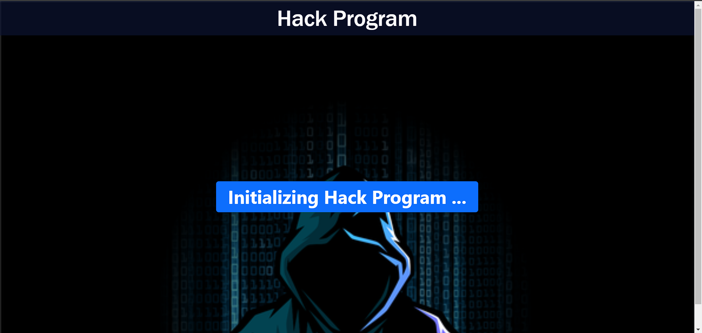

# Hackman Program

A simple demonstration of asynchronous functions, promises, and callbacks using HTML, CSS, and JavaScript.

## Table of Contents

- [Introduction](#introduction)
- [Demo](#demo)
- [Features](#features)
- [Code Overview](#code-overview)
- [Usage](#usage)
- [Contributing](#contributing)
- [License](#license)


## Introduction

The Hackman Program is a practice project showcasing the use of asynchronous functions, promises, and callbacks in JavaScript. The program simulates a hacking sequence, demonstrating the flow of asynchronous operations to achieve a specific task.

## Demo



## Features

- **Asynchronous Functions**: Utilizes asynchronous functions to simulate time-delayed tasks.
- **Promises**: Implements promises to handle asynchronous operations in a sequential manner.
- **Interactive Display**: Updates an HTML element to display each step of the hacking process.

## Code Overview

The code consists of a series of asynchronous functions (`p1` to `p5`) simulating various stages of a hacking sequence. The main function, `hackerman`, orchestrates these functions using the `await` keyword to ensure a sequential flow.

```javascript
// Code snippet for illustration purposes. See full code in hackman.js

const hackerman = async () => {
    let a = await p1();
    console.log(a);

    let b = await p2();
    console.log(b);

    let c = await p3();
    console.log(c);

    let d = await p4();
    console.log(d);

    let e = await p5();
    console.log(e);
}

hackerman();
```

# Usage

## 1. Clone the repository:

```bash
git clone https://github.com/subrat29/hackman-program.git
cd hackman-program
```

## 2. Open the index.html file in your preferred web browser to observe the hacking sequence.


# Contributing
Contributions are welcome! If you find any issues or have suggestions for improvements, please open an issue or submit a pull request. Make sure to follow the contributing guidelines.